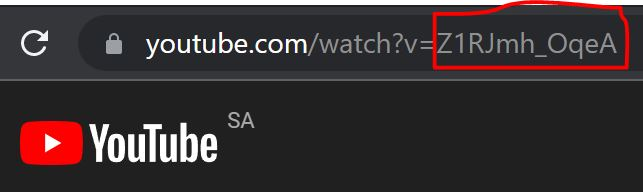
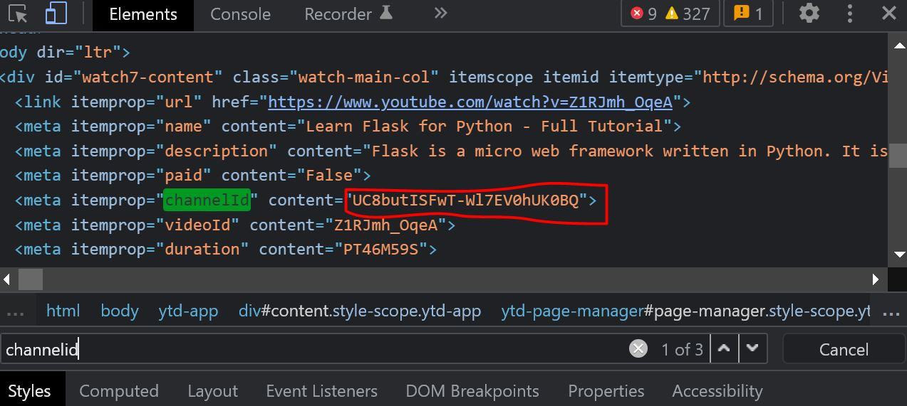

# Youtube Content Quality Classification
Capstone project for MISK-DSI 2022

## Demo
To try out the demo, go to [this link](https://yt-content-quality.herokuapp.com/) and follow these instructions:

- Input the video Id which can be found in the URL after `watch?v=`

<br/>
- Input the channel Id which can be found using the inspect tool in your browser. First right click on the page and choose inspect, after that click CRTL + F to search the HTML code. Search for channelid you should be able to see a channelid inside a `meta` tag, next to it you will find `content` copy the value inside the content.
<br/>

<br/>

## Introduction
In this project, my goal is to create a Machine Learning model to classify Youtube videos based on content quality into two classes: `Reputable`, and `non reputable`. My aim is to make the process of finding good tutorials easier for everyday users and researchers.

### Background of the problem
After Youtube removed the dislike count, it became much harder to know if a tutorial is good or bad. This was a big problem for me as I watch a lot of tech tutorials on Youtube, that's why I decided to build a Machine learning model that can classify videos. 

### Goal
My goal is to collect video data from Youtube API and analyze them to understand better what makes a tutorial good or bad. After that, I want to build a classification model to classify videos into `Reputable`, and `non reputable`.

## Data
I fetched the data using Youtube API, you can find the code I used to do that in the ```data``` folder. In this project I only collected data for different tutorials on Youtube (Please note that the labeling of videos reflect what I see as reputable or not)

### Data dictionary:

| Variable      | Description |
| ----------- | ----------- |
| video_id    | The id of the Youtube video.       |
| channelTitle   | Name of the channel.       |
| title  | Title of the video.        |
| description   | The video description.        |
| tags   | List of tags in the video description.        |
| publishedAt   | The publish date of the video.         |
| viewCount   | Views of the video.       |
| likeCount   | Likes of the video.        |
| commentCount   | Number of comments on the video.      |
| duration   | The duration of the video.        |
| definition   | The video quality definition.       |
| caption   | Whether the video has caption or not.       |
| subscribers   | Number of subscribers the channel has.      |
| totalViews   | Total number of views the channel has.      |
| totalVideos   | Total number of videos the channel uploaded.      |
| avg polarity score   | The average polarity score for the comments of the video.      |
| Label   | Label of the video as Reputable or not.      |


## Data Collection and Pre-Processing
As mentioned above, I couldn't find any dataset online that can help me in my project so I decided to collect them myself using Youtube API. After collecting the data, I cleaned it and removed and duplicates or null values. The code for this section can be found in `code.ipynb` file in `src` folder.

## Exploratory Data Analysis(EDA)
The code for this section can be found in `src` folder inside `code.ipynb` file. 

Here I did basic EDA to understand the data types, and the correlation between my data. I found that my data was unbalnced so I needed to do oversampling to fix it. I also found that the highest correlation between my features and target `Label` was with `subscribers` and `totalViews`

## Modeling
Because I couldn't label all the data myself as it's a time and resources intensive process (and I was short on both). I decided to label them using two methods:

- Semisupervised
- Unsupervised

### Semisupervised
For the Semisupervised part, I built an initial model using the small dataset I labeled, then used it to label the rest of the data. After trying different models, I went with Logistic Regression as it performed good and showed less signs of overfitting.

The code for this part can be found in `code.ipynb` file in the `src` folder. 

### Unsupervised
For the Unsupervised part, I clustered the data using K-Cluster into two clusters as I had two labels. The results were disappointing but it gave me an idea of increasing the labels to more than 2.

The code for this section can be found in `src` folder inside `unupervisedML.ipynb` file.

### Final model
After labeling the data, I used the new dataset to build the final model. After trying different models, I went with Random Forest as it performed the best.

The code for this section can be found in `src` folder inside `semisupervisedML.ipynb` file.

All the models can be found inside the `Model` folder

## Conclusion
Trying to classify videos based on the features we have turned out to be a difficult job for multiple reaonse such as:

- The dataset used for the initial model is too small 
- The features we have don't cover everything and can only go so far

Never the less. here are the best models for our project:

- Logistic regression 
- Random Forest 

### Limitations & problems
There are several limits and problems with this project, here are some of them:

- Bias in the dataset 
- Limited and small dataset especially for non reputable videos
- Need more features to improve the model
- The number of labels need to be increased

### Challenges
During this project, I faced several challenges like:

- Limited time (less than 2 weeks)
- Watching and labeling a lot of videos manually
- Not enough resources online
- Microsoft Excel 

### Future development
I didn’t have enough time to do everything I wished for this project, here are some of the future developments I have in mind:

- Collect more data
- Apply it on different categories of videos like news
- Use computer vision on the video and thumbnail 
- Look for collaborators (if you are interested feel free to contact me)
- Use NLP on the description and title
- Make a website or an extension to use the model


